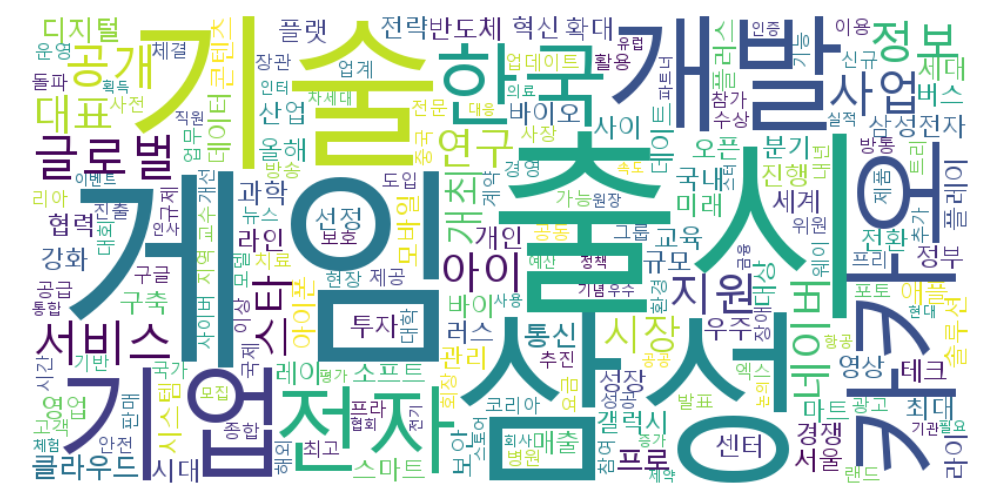
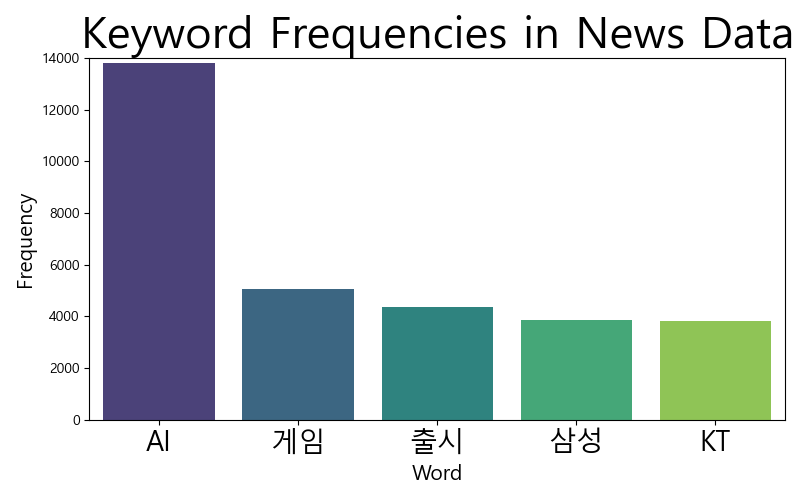

# 시각화(최빈값 분석)

---

### 1. 전체 기사별 제목을 하나의 문자열로 변환
- merge_daum_naver

### 2. 주요 주제 파악을 위해 최빈값 3개를 키워드로 선정
- 각 기사 본문에서 가장 많이 등장한 단어 3개 추출.
- 주요 주제 파악을 위해 중요한 단어들을 선정.
- words: 기사 본문을 공백 기준으로 토큰화
- word_counts: 단어 빈도 카운트
- word_count_dict: 기사별 상위 3개 단어 딕셔너리로 저장

### 3. 전체 기사 제목에서의 키워드 분석
- 기사에서 추출된 상위 3개 단어의 빈도 분석.
- 기사 제목에 반영된 주요 키워드 파악.
- unique_key: 전체 키워드  중복 제거
- count_title_content: merge_daum_naver에서 unique_key 카운드 
- Frequency: unique_key와 count_title_content를 DataFrame(컬럼명:word, frequency) 저장

## 🔔 일반 단어 분석
---
### 상위 5개 단어 빈도 분석
- 323,456개의 기사에서 자주 등장한 단어 2,536개 중 **상위 5개**를 선택하여 **막대 그래프**로 시각화.
- *2023. 09. 01 ~ 2024. 09*. 01, 1년 동안 가장 주목 받은 **키워드** 확인 가능.

### 워드 클라우드 시각화
- **단어의 빈도**에 따라 크기가 달라지는 시각적 도구로, **중요한 키워드**를 한눈에 확인할 수 있음.

### 상위 1000개의 단어 빈도 분석
- 총 2,536개의 단어 중 상위 1000개의 단어를 최대 등장 횟수 1000개까지 **막대 그래프**로 시각화.
- 데이터의 전반적인 경향을 파악하고, 추후 관련 기사를 추천하는 시스템에 **타당성**을 얻음.

## 🔎 최신 기술 동향 단어 분석
---

### 상위 5개 기술/기업 단어 빈도 분석
- 86,970개의 기사에서 자주 등장한 단어 29,106중 **상위 5개**를 선택하여 **막대 그래프**로 시각화.
- *2024. 06. 01 ~ 2024. 09. 01*, 3개월 동안 가장 주목 받은 기술과 기업명 키워드 확인 가능.

### 워드 클라우드 시각화
- **단어의 빈도**에 따라 크기가 달라지는 시각적 도구로, **중요한 키워드**를 한눈에 확인할 수 있음.

### 상위 500개의 단어 빈도 분석
- 총 14,759개의 단어 중 상위 500개의 단어를 최대 등장 횟수 1000개까지 **막대 그래프**로 시각화.
- 데이터의 전반적인 경향을 파악하고, 추후 관련 기사를 추천하는 시스템에 **타당성**을 얻음.
